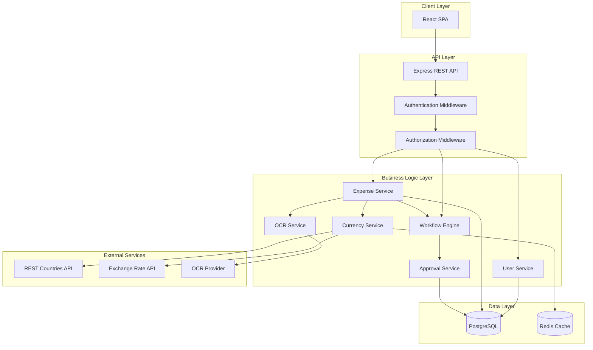
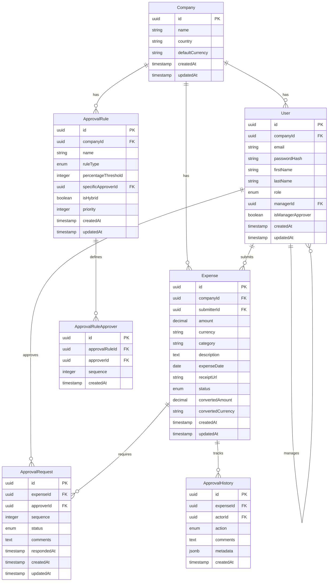
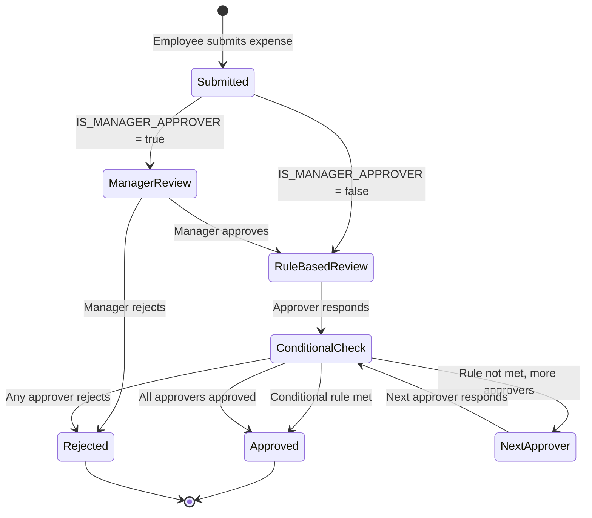

# Design Document

## Overview

The Expense Management System is a web-based application that automates expense reimbursement workflows with multi-level approvals, conditional approval rules, and OCR-based receipt scanning. The system follows a three-tier architecture with a React frontend, Node.js/Express backend, and PostgreSQL database. It integrates with external APIs for currency data and exchange rates, and uses OCR technology for automated receipt processing.

### Key Design Principles

- **Role-Based Access Control (RBAC)**: Strict separation of permissions between Admin, Manager, and Employee roles
- **Workflow Engine**: Flexible approval workflow engine supporting both sequential and conditional approval patterns
- **Multi-Currency Support**: Real-time currency conversion with caching for performance
- **Audit Trail**: Complete tracking of all expense state changes and approval actions
- **Scalability**: Designed to handle multiple companies with isolated data

## Architecture

### System Architecture



### Technology Stack

**Frontend:**
- React 18+ with TypeScript
- React Router for navigation
- Axios for API calls
- TanStack Query (React Query) for state management and caching
- Tailwind CSS for styling
- React Hook Form for form handling
- Zod for validation

**Backend:**
- Node.js with Express
- TypeScript
- JWT for authentication
- Bcrypt for password hashing
- Multer for file uploads

**Database:**
- PostgreSQL for relational data
- Redis for caching (exchange rates, session data)

**External Integrations:**
- REST Countries API for country/currency data
- Exchange Rate API for currency conversion
- Tesseract.js or cloud OCR service (Google Vision API, AWS Textract) for receipt scanning

## Components and Interfaces

### Frontend Components

#### Authentication Components
- `LoginPage`: User login interface
- `SignupPage`: First-time user registration with country selection
- `AuthProvider`: Context provider for authentication state

#### Admin Components
- `UserManagement`: Create/edit users, assign roles, define manager relationships
- `ApprovalRuleConfig`: Configure approval workflows and conditional rules
- `CompanySettings`: Manage company details and default currency
- `AllExpensesView`: View all expenses across the organization

#### Manager Components
- `PendingApprovalsView`: List of expenses awaiting approval
- `ExpenseApprovalDetail`: Detailed view with approve/reject actions
- `TeamExpensesView`: View all expenses from direct reports

#### Employee Components
- `ExpenseSubmissionForm`: Form to submit new expenses with OCR upload
- `ExpenseHistoryView`: List of submitted expenses with status
- `ExpenseDetailView`: Detailed view of expense with approval history

#### Shared Components
- `CurrencySelector`: Dropdown for currency selection
- `ExpenseStatusBadge`: Visual indicator for expense status
- `ApprovalTimeline`: Visual representation of approval workflow progress
- `ReceiptUploader`: Component for uploading and previewing receipts

### Backend API Endpoints

#### Authentication Endpoints
```
POST /api/auth/signup - Create new company and admin user
POST /api/auth/login - Authenticate user
POST /api/auth/logout - Invalidate session
GET /api/auth/me - Get current user info
```

#### User Management Endpoints (Admin only)
```
POST /api/users - Create new user
GET /api/users - List all users in company
GET /api/users/:id - Get user details
PUT /api/users/:id - Update user
DELETE /api/users/:id - Delete user
PUT /api/users/:id/role - Change user role
PUT /api/users/:id/manager - Assign manager
```

#### Expense Endpoints
```
POST /api/expenses - Submit new expense (Employee)
GET /api/expenses - List expenses (filtered by role)
GET /api/expenses/:id - Get expense details
PUT /api/expenses/:id - Update expense (Employee, before approval)
DELETE /api/expenses/:id - Delete expense (Employee, before approval)
POST /api/expenses/:id/approve - Approve expense (Manager/Admin)
POST /api/expenses/:id/reject - Reject expense (Manager/Admin)
GET /api/expenses/:id/history - Get approval history
```

#### Approval Rule Endpoints (Admin only)
```
POST /api/approval-rules - Create approval rule
GET /api/approval-rules - List approval rules
PUT /api/approval-rules/:id - Update approval rule
DELETE /api/approval-rules/:id - Delete approval rule
```

#### OCR Endpoints
```
POST /api/ocr/scan - Upload receipt and extract data
```

#### Currency Endpoints
```
GET /api/currencies/countries - Get list of countries with currencies
GET /api/currencies/convert - Convert amount between currencies
```

### Service Interfaces

#### UserService
```typescript
interface UserService {
  createUser(data: CreateUserDTO): Promise<User>
  getUserById(id: string): Promise<User>
  getUsersByCompany(companyId: string): Promise<User[]>
  updateUser(id: string, data: UpdateUserDTO): Promise<User>
  deleteUser(id: string): Promise<void>
  assignRole(userId: string, role: UserRole): Promise<User>
  assignManager(userId: string, managerId: string): Promise<void>
}
```

#### ExpenseService
```typescript
interface ExpenseService {
  createExpense(data: CreateExpenseDTO): Promise<Expense>
  getExpenseById(id: string): Promise<Expense>
  getExpensesByUser(userId: string): Promise<Expense[]>
  getExpensesByCompany(companyId: string): Promise<Expense[]>
  getPendingApprovalsForUser(userId: string): Promise<Expense[]>
  updateExpense(id: string, data: UpdateExpenseDTO): Promise<Expense>
  deleteExpense(id: string): Promise<void>
}
```

#### WorkflowEngine
```typescript
interface WorkflowEngine {
  initiateWorkflow(expenseId: string): Promise<void>
  processApproval(expenseId: string, approverId: string, decision: ApprovalDecision): Promise<void>
  evaluateConditionalRules(expenseId: string): Promise<boolean>
  getNextApprover(expenseId: string): Promise<User | null>
  isWorkflowComplete(expenseId: string): Promise<boolean>
}
```

#### ApprovalService
```typescript
interface ApprovalService {
  createApprovalRequest(expenseId: string, approverId: string, sequence: number): Promise<ApprovalRequest>
  approveExpense(requestId: string, approverId: string, comments?: string): Promise<void>
  rejectExpense(requestId: string, approverId: string, comments: string): Promise<void>
  getApprovalHistory(expenseId: string): Promise<ApprovalHistory[]>
}
```

#### OCRService
```typescript
interface OCRService {
  scanReceipt(imageBuffer: Buffer): Promise<OCRResult>
  extractExpenseData(ocrResult: OCRResult): Promise<ExtractedExpenseData>
}
```

#### CurrencyService
```typescript
interface CurrencyService {
  getCountriesWithCurrencies(): Promise<CountryCurrency[]>
  getExchangeRate(fromCurrency: string, toCurrency: string): Promise<number>
  convertAmount(amount: number, fromCurrency: string, toCurrency: string): Promise<number>
  getCachedRates(baseCurrency: string): Promise<ExchangeRates | null>
  cacheRates(baseCurrency: string, rates: ExchangeRates): Promise<void>
}
```

## Data Models

### Database Schema



### TypeScript Interfaces

```typescript
enum UserRole {
  ADMIN = 'ADMIN',
  MANAGER = 'MANAGER',
  EMPLOYEE = 'EMPLOYEE'
}

enum ExpenseStatus {
  PENDING = 'PENDING',
  APPROVED = 'APPROVED',
  REJECTED = 'REJECTED'
}

enum ApprovalRequestStatus {
  PENDING = 'PENDING',
  APPROVED = 'APPROVED',
  REJECTED = 'REJECTED'
}

enum ApprovalRuleType {
  SEQUENTIAL = 'SEQUENTIAL',
  PERCENTAGE = 'PERCENTAGE',
  SPECIFIC_APPROVER = 'SPECIFIC_APPROVER',
  HYBRID = 'HYBRID'
}

interface Company {
  id: string
  name: string
  country: string
  defaultCurrency: string
  createdAt: Date
  updatedAt: Date
}

interface User {
  id: string
  companyId: string
  email: string
  firstName: string
  lastName: string
  role: UserRole
  managerId?: string
  isManagerApprover: boolean
  createdAt: Date
  updatedAt: Date
}

interface Expense {
  id: string
  companyId: string
  submitterId: string
  amount: number
  currency: string
  category: string
  description: string
  expenseDate: Date
  receiptUrl?: string
  status: ExpenseStatus
  convertedAmount: number
  convertedCurrency: string
  createdAt: Date
  updatedAt: Date
}

interface ApprovalRule {
  id: string
  companyId: string
  name: string
  ruleType: ApprovalRuleType
  percentageThreshold?: number
  specificApproverId?: string
  isHybrid: boolean
  priority: number
  approvers: ApprovalRuleApprover[]
  createdAt: Date
  updatedAt: Date
}

interface ApprovalRuleApprover {
  id: string
  approvalRuleId: string
  approverId: string
  sequence: number
  createdAt: Date
}

interface ApprovalRequest {
  id: string
  expenseId: string
  approverId: string
  sequence: number
  status: ApprovalRequestStatus
  comments?: string
  respondedAt?: Date
  createdAt: Date
  updatedAt: Date
}

interface ApprovalHistory {
  id: string
  expenseId: string
  actorId: string
  action: string
  comments?: string
  metadata?: Record<string, any>
  createdAt: Date
}
```

## Error Handling

### Error Types

```typescript
class AppError extends Error {
  statusCode: number
  isOperational: boolean
  
  constructor(message: string, statusCode: number) {
    super(message)
    this.statusCode = statusCode
    this.isOperational = true
    Error.captureStackTrace(this, this.constructor)
  }
}

class ValidationError extends AppError {
  constructor(message: string) {
    super(message, 400)
  }
}

class AuthenticationError extends AppError {
  constructor(message: string = 'Authentication failed') {
    super(message, 401)
  }
}

class AuthorizationError extends AppError {
  constructor(message: string = 'Insufficient permissions') {
    super(message, 403)
  }
}

class NotFoundError extends AppError {
  constructor(resource: string) {
    super(`${resource} not found`, 404)
  }
}

class ExternalServiceError extends AppError {
  constructor(service: string) {
    super(`External service ${service} unavailable`, 503)
  }
}
```

### Error Handling Strategy

1. **Validation Errors**: Return 400 with detailed field-level errors
2. **Authentication Errors**: Return 401 and clear session
3. **Authorization Errors**: Return 403 with permission requirements
4. **Not Found Errors**: Return 404 with resource identifier
5. **External Service Errors**: Return 503 with retry information
6. **Database Errors**: Log details, return 500 with generic message
7. **Unexpected Errors**: Log full stack trace, return 500 with error ID

### Global Error Handler

```typescript
const errorHandler = (err: Error, req: Request, res: Response, next: NextFunction) => {
  if (err instanceof AppError && err.isOperational) {
    return res.status(err.statusCode).json({
      status: 'error',
      message: err.message
    })
  }
  
  // Log unexpected errors
  logger.error('Unexpected error:', err)
  
  return res.status(500).json({
    status: 'error',
    message: 'An unexpected error occurred',
    errorId: generateErrorId()
  })
}
```

## Workflow Engine Design

### Workflow Processing Logic

The workflow engine is the core component that orchestrates expense approvals. It handles both sequential multi-level approvals and conditional approval rules.

#### Workflow Initialization

When an expense is submitted:
1. Check if "IS MANAGER APPROVER" is enabled for the submitter
2. If yes, create first approval request for the submitter's manager
3. If no, load company approval rules and create requests based on rule configuration
4. Set expense status to PENDING

#### Sequential Approval Processing

```typescript
async function processSequentialApproval(expenseId: string, approverId: string, decision: ApprovalDecision) {
  // Update current approval request
  await updateApprovalRequest(expenseId, approverId, decision)
  
  // Log to approval history
  await logApprovalAction(expenseId, approverId, decision)
  
  if (decision === 'REJECTED') {
    await updateExpenseStatus(expenseId, 'REJECTED')
    return
  }
  
  // Check if conditional rules are met
  const conditionalRuleMet = await evaluateConditionalRules(expenseId)
  if (conditionalRuleMet) {
    await updateExpenseStatus(expenseId, 'APPROVED')
    return
  }
  
  // Get next approver in sequence
  const nextApprover = await getNextApprover(expenseId)
  
  if (nextApprover) {
    await createApprovalRequest(expenseId, nextApprover.id, nextSequence)
    await notifyApprover(nextApprover, expenseId)
  } else {
    // All sequential approvers have approved
    await updateExpenseStatus(expenseId, 'APPROVED')
  }
}
```

#### Conditional Rule Evaluation

```typescript
async function evaluateConditionalRules(expenseId: string): Promise<boolean> {
  const expense = await getExpenseById(expenseId)
  const rules = await getApprovalRulesByCompany(expense.companyId)
  
  for (const rule of rules) {
    if (rule.ruleType === 'PERCENTAGE' || rule.ruleType === 'HYBRID') {
      const approvalCount = await getApprovalCount(expenseId)
      const totalApprovers = await getTotalApprovers(rule.id)
      const approvalPercentage = (approvalCount / totalApprovers) * 100
      
      if (approvalPercentage >= rule.percentageThreshold) {
        return true
      }
    }
    
    if (rule.ruleType === 'SPECIFIC_APPROVER' || rule.ruleType === 'HYBRID') {
      const specificApproverApproved = await hasSpecificApproverApproved(
        expenseId,
        rule.specificApproverId
      )
      
      if (specificApproverApproved) {
        return true
      }
    }
  }
  
  return false
}
```

### Workflow State Machine



## Testing Strategy

### Unit Testing

**Backend Services:**
- Test each service method in isolation with mocked dependencies
- Test validation logic for all DTOs
- Test error handling for edge cases
- Test workflow engine logic with various approval scenarios
- Test currency conversion with mocked API responses
- Test OCR extraction with sample receipt images

**Frontend Components:**
- Test component rendering with different props
- Test user interactions (form submissions, button clicks)
- Test conditional rendering based on user roles
- Test form validation logic
- Test API integration with mocked responses

### Integration Testing

**API Endpoints:**
- Test complete request/response cycles
- Test authentication and authorization middleware
- Test database transactions
- Test external API integrations with test endpoints
- Test file upload functionality

**Workflow Scenarios:**
- Test sequential approval with multiple approvers
- Test conditional approval with percentage rules
- Test conditional approval with specific approver rules
- Test hybrid approval rules
- Test manager approval combined with rule-based approval
- Test rejection at different workflow stages

### End-to-End Testing

**User Flows:**
- Complete signup and company creation flow
- Admin creates users and configures approval rules
- Employee submits expense with OCR
- Manager approves expense
- Multi-level approval workflow completion
- Expense rejection and resubmission
- Currency conversion display for international expenses

### Testing Tools

- **Unit Tests**: Jest, React Testing Library
- **Integration Tests**: Supertest for API testing
- **E2E Tests**: Playwright or Cypress
- **Mocking**: MSW (Mock Service Worker) for API mocking
- **Test Database**: PostgreSQL test instance with migrations

### Test Coverage Goals

- Minimum 80% code coverage for backend services
- Minimum 70% code coverage for frontend components
- 100% coverage for critical paths (authentication, approval workflow, payment processing)

## Security Considerations

### Authentication & Authorization

- JWT tokens with short expiration (15 minutes) and refresh tokens
- Password hashing with bcrypt (minimum 10 rounds)
- Role-based access control enforced at API and service layers
- Session invalidation on logout

### Data Protection

- Encrypt sensitive data at rest (passwords, tokens)
- Use HTTPS for all communications
- Sanitize user inputs to prevent SQL injection
- Validate file uploads (type, size, content)
- Implement rate limiting on API endpoints

### Audit Trail

- Log all approval actions with timestamps
- Track all expense state changes
- Record admin override actions
- Maintain immutable approval history

## Performance Optimization

### Caching Strategy

- Cache exchange rates for 1 hour in Redis
- Cache country/currency data indefinitely (refresh daily)
- Cache user permissions for session duration
- Implement query result caching for frequently accessed data

### Database Optimization

- Index foreign keys and frequently queried columns
- Use database connection pooling
- Implement pagination for list endpoints
- Use database transactions for multi-step operations
- Optimize queries with proper joins and selective loading

### Frontend Optimization

- Implement code splitting for route-based lazy loading
- Use React Query for automatic caching and background refetching
- Optimize images and receipts with compression
- Implement virtual scrolling for long lists
- Debounce search and filter inputs

