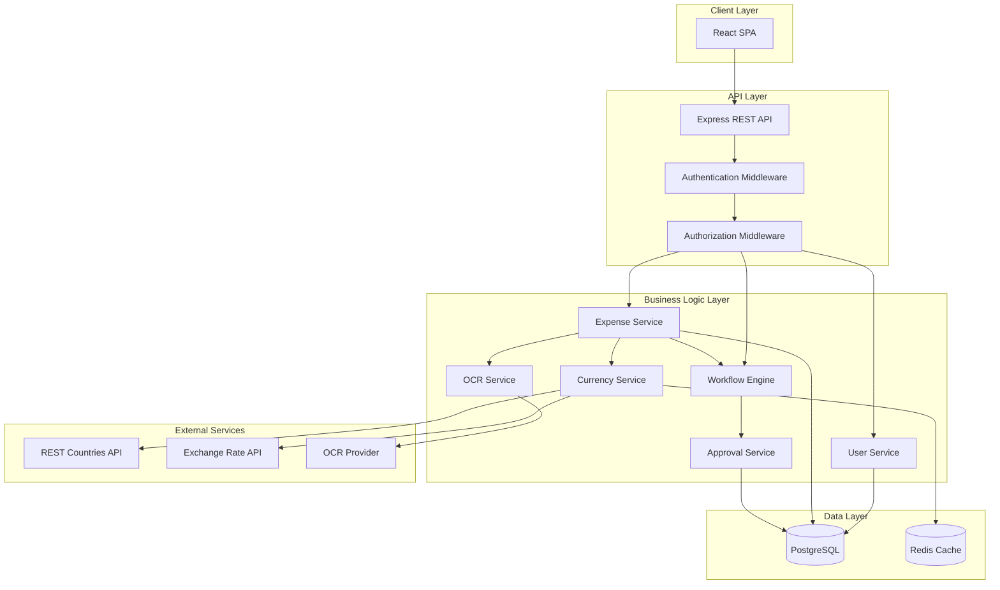
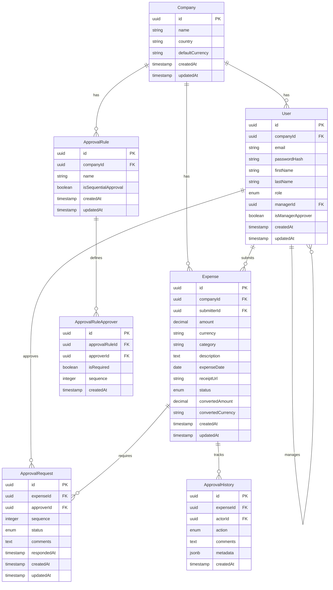
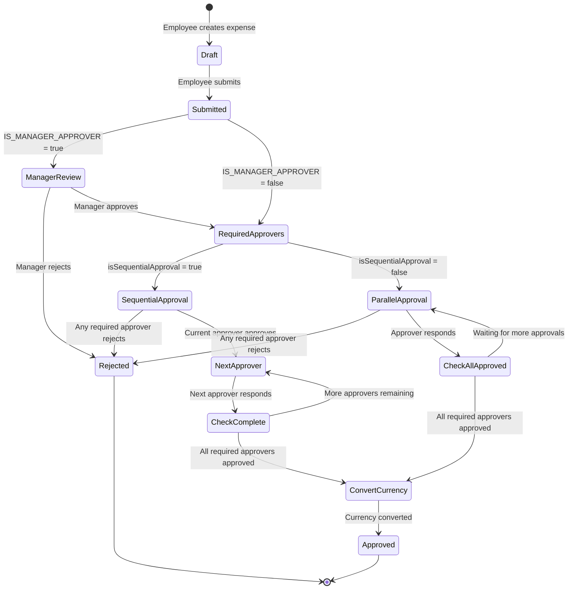

# Design Document

## Overview

The Expense Management System is a web-based application that automates expense reimbursement workflows with multi-level approvals, conditional approval rules, and OCR-based receipt scanning. The system follows a three-tier architecture with a React frontend, Node.js/Express backend, and PostgreSQL database. It integrates with external APIs for currency data and exchange rates, and uses OCR technology for automated receipt processing.

### Key Design Principles

- **Role-Based Access Control (RBAC)**: Strict separation of permissions between Admin, Manager, and Employee roles
- **Flexible Workflow Engine**: Configurable approval workflows supporting sequential, parallel, and hybrid approval patterns with required approvers
- **Multi-Currency Support**: Real-time currency conversion at approval time with caching for performance
- **Audit Trail**: Complete tracking of all expense state changes and approval actions
- **Scalability**: Designed to handle multiple companies with isolated data
- **User-Friendly Onboarding**: Automated company setup with country/currency selection and password generation for new users

## Architecture

### System Architecture



### Technology Stack

**Frontend:**
- React 18+ with TypeScript
- React Router for navigation
- Axios for API calls
- TanStack Query (React Query) for state management and caching
- Tailwind CSS for styling
- React Hook Form for form handling
- Zod for validation

**Backend:**
- Node.js with Express
- TypeScript
- JWT for authentication
- Bcrypt for password hashing
- Multer for file uploads

**Database:**
- PostgreSQL for relational data
- Redis for caching (exchange rates, session data)

**External Integrations:**
- REST Countries API for country/currency data
- Exchange Rate API for currency conversion
- Tesseract.js or cloud OCR service (Google Vision API, AWS Textract) for receipt scanning

## Components and Interfaces

### Frontend Components

#### Authentication Components
- `LoginPage`: User login interface
- `SignupPage`: First-time user registration with country and currency selection
  - Fetches countries from REST Countries API
  - Displays country dropdown using `name.common` field
  - Auto-selects currency if country has one currency
  - Shows currency dropdown if country has multiple currencies
  - Sends selected currency code to backend during company creation
- `AuthProvider`: Context provider for authentication state

#### Admin Components
- `UserManagement`: Create/edit users, assign roles, define manager relationships (Admin-only access)
- `UserForm`: Dynamic form for creating/editing users with role-based field visibility
  - Shows Manager dropdown only for Employee role
  - Includes "Send Password" button to generate and email random password
  - Validates password requirements (8+ chars, uppercase, lowercase, numbers, special chars)
- `ApprovalRuleConfig`: Configure approval workflows with three-part configuration:
  - "Is Manager Approver" checkbox for employee-level manager approval
  - Required Approvers list with checkmarks for mandatory approvers
  - "Approvers Sequence" checkbox to toggle sequential vs parallel approval
- `CompanySettings`: Manage company details and default currency
- `AllExpensesView`: View all expenses across the organization

#### Manager Components
- `PendingApprovalsView`: List of expenses awaiting approval
- `ExpenseApprovalDetail`: Detailed view with approve/reject actions
- `TeamExpensesView`: View all expenses from direct reports

#### Employee Components
- `ExpenseSubmissionForm`: Form to submit new expenses with OCR upload
  - Supports expense submission in any currency
  - Allows saving drafts without submission
- `ExpenseDashboard`: Dashboard showing three expense categories:
  - "Amount to Submit" - Draft expenses not yet submitted
  - "Waiting Approval" - Submitted expenses pending approval
  - "Approved" - Approved expenses
- `ExpenseHistoryView`: List of submitted expenses with status
- `ExpenseDetailView`: Detailed view of expense with approval history

#### Shared Components
- `CurrencySelector`: Dropdown for currency selection
- `ExpenseStatusBadge`: Visual indicator for expense status
- `ApprovalTimeline`: Visual representation of approval workflow progress
- `ReceiptUploader`: Component for uploading and previewing receipts
- `RoleBasedGuard`: Component wrapper for role-based UI element visibility

### Backend API Endpoints

#### Authentication Endpoints
```
POST /api/auth/signup - Create new company and admin user
POST /api/auth/login - Authenticate user
POST /api/auth/logout - Invalidate session
GET /api/auth/me - Get current user info
```

#### User Management Endpoints (Admin only)
```
POST /api/users - Create new user
POST /api/users/generate-password - Generate random password and send via email
GET /api/users - List all users in company
GET /api/users/:id - Get user details
PUT /api/users/:id - Update user
DELETE /api/users/:id - Delete user
PUT /api/users/:id/role - Change user role
PUT /api/users/:id/manager - Assign manager
```

#### Expense Endpoints
```
POST /api/expenses - Submit new expense (Employee)
GET /api/expenses - List expenses (filtered by role)
GET /api/expenses/:id - Get expense details
PUT /api/expenses/:id - Update expense (Employee, before approval)
DELETE /api/expenses/:id - Delete expense (Employee, before approval)
POST /api/expenses/:id/approve - Approve expense (Manager/Admin)
POST /api/expenses/:id/reject - Reject expense (Manager/Admin)
GET /api/expenses/:id/history - Get approval history
```

#### Approval Rule Endpoints (Admin only)
```
POST /api/approval-rules - Create approval rule
GET /api/approval-rules - List approval rules
PUT /api/approval-rules/:id - Update approval rule
DELETE /api/approval-rules/:id - Delete approval rule
```

#### OCR Endpoints
```
POST /api/ocr/scan - Upload receipt and extract data
```

#### Currency Endpoints
```
GET /api/currencies/countries - Get list of countries with currencies
GET /api/currencies/convert - Convert amount between currencies
```

### Service Interfaces

#### UserService
```typescript
interface UserService {
  createUser(data: CreateUserDTO, creatorRole: UserRole): Promise<User>
  generateAndSendPassword(email: string): Promise<{ password: string, sent: boolean }>
  getUserById(id: string): Promise<User>
  getUsersByCompany(companyId: string): Promise<User[]>
  updateUser(id: string, data: UpdateUserDTO): Promise<User>
  deleteUser(id: string): Promise<void>
  assignRole(userId: string, role: UserRole): Promise<User>
  assignManager(userId: string, managerId: string): Promise<void>
  validateSingleAdminConstraint(companyId: string): Promise<boolean>
  canUserCreateUsers(userId: string): Promise<boolean>
}
```

#### ExpenseService
```typescript
interface ExpenseService {
  createExpense(data: CreateExpenseDTO): Promise<Expense>
  saveDraftExpense(data: CreateExpenseDTO): Promise<Expense>
  submitExpense(expenseId: string): Promise<Expense>
  getExpenseById(id: string): Promise<Expense>
  getExpensesByUser(userId: string): Promise<Expense[]>
  getExpensesByCategory(userId: string, category: ExpenseCategory): Promise<Expense[]>
  getExpensesByCompany(companyId: string): Promise<Expense[]>
  getPendingApprovalsForUser(userId: string): Promise<Expense[]>
  updateExpense(id: string, data: UpdateExpenseDTO): Promise<Expense>
  deleteExpense(id: string): Promise<void>
}
```

#### WorkflowEngine
```typescript
interface WorkflowEngine {
  initiateWorkflow(expenseId: string): Promise<void>
  processApproval(expenseId: string, approverId: string, decision: ApprovalDecision): Promise<void>
  checkManagerApproverRequired(employeeId: string): Promise<boolean>
  getRequiredApprovers(companyId: string): Promise<User[]>
  isSequentialApprovalEnabled(companyId: string): Promise<boolean>
  sendParallelApprovalRequests(expenseId: string, approvers: User[]): Promise<void>
  sendSequentialApprovalRequest(expenseId: string, approver: User, sequence: number): Promise<void>
  checkAllRequiredApproversApproved(expenseId: string): Promise<boolean>
  getNextApprover(expenseId: string): Promise<User | null>
  isWorkflowComplete(expenseId: string): Promise<boolean>
}
```

#### ApprovalService
```typescript
interface ApprovalService {
  createApprovalRequest(expenseId: string, approverId: string, sequence: number): Promise<ApprovalRequest>
  approveExpense(requestId: string, approverId: string, comments?: string): Promise<void>
  rejectExpense(requestId: string, approverId: string, comments: string): Promise<void>
  getApprovalHistory(expenseId: string): Promise<ApprovalHistory[]>
}
```

#### OCRService
```typescript
interface OCRService {
  scanReceipt(imageBuffer: Buffer): Promise<OCRResult>
  extractExpenseData(ocrResult: OCRResult): Promise<ExtractedExpenseData>
}
```

#### CurrencyService
```typescript
interface CountryData {
  name: {
    common: string
    official: string
  }
  currencies: {
    [code: string]: {
      name: string
      symbol: string
    }
  }
}

interface CurrencyService {
  fetchCountriesFromAPI(): Promise<CountryData[]>
  getCountriesWithCurrencies(): Promise<CountryCurrency[]>
  getCurrenciesForCountry(countryName: string): Promise<string[]>
  getExchangeRates(baseCurrency: string): Promise<ExchangeRates>
  convertAmount(amount: number, fromCurrency: string, toCurrency: string, rates: ExchangeRates): Promise<number>
  getCachedRates(baseCurrency: string): Promise<ExchangeRates | null>
  cacheRates(baseCurrency: string, rates: ExchangeRates, ttl: number): Promise<void>
}
```

## Data Models

### Database Schema



### TypeScript Interfaces

```typescript
enum UserRole {
  ADMIN = 'ADMIN',
  MANAGER = 'MANAGER',
  EMPLOYEE = 'EMPLOYEE'
}

enum ExpenseStatus {
  DRAFT = 'DRAFT',
  PENDING = 'PENDING',
  APPROVED = 'APPROVED',
  REJECTED = 'REJECTED'
}

enum ExpenseCategory {
  AMOUNT_TO_SUBMIT = 'AMOUNT_TO_SUBMIT',  // Draft expenses
  WAITING_APPROVAL = 'WAITING_APPROVAL',  // Submitted, pending approval
  APPROVED = 'APPROVED'                    // Approved expenses
}

enum ApprovalRequestStatus {
  PENDING = 'PENDING',
  APPROVED = 'APPROVED',
  REJECTED = 'REJECTED'
}

enum ApprovalRuleType {
  SEQUENTIAL = 'SEQUENTIAL',
  PERCENTAGE = 'PERCENTAGE',
  SPECIFIC_APPROVER = 'SPECIFIC_APPROVER',
  HYBRID = 'HYBRID'
}

interface Company {
  id: string
  name: string
  country: string
  defaultCurrency: string
  createdAt: Date
  updatedAt: Date
}

interface User {
  id: string
  companyId: string
  email: string
  firstName: string
  lastName: string
  role: UserRole
  managerId?: string
  isManagerApprover: boolean
  createdAt: Date
  updatedAt: Date
}

interface Expense {
  id: string
  companyId: string
  submitterId: string
  amount: number
  currency: string
  category: string
  description: string
  expenseDate: Date
  receiptUrl?: string
  status: ExpenseStatus
  convertedAmount: number
  convertedCurrency: string
  createdAt: Date
  updatedAt: Date
}

interface ApprovalRule {
  id: string
  companyId: string
  name: string
  isSequentialApproval: boolean  // True = sequential, False = parallel
  approvers: ApprovalRuleApprover[]
  createdAt: Date
  updatedAt: Date
}

interface ApprovalRuleApprover {
  id: string
  approvalRuleId: string
  approverId: string
  isRequired: boolean  // True = required approver (checkmark)
  sequence: number     // Order for sequential approval
  createdAt: Date
}

interface ApprovalRequest {
  id: string
  expenseId: string
  approverId: string
  sequence: number
  status: ApprovalRequestStatus
  comments?: string
  respondedAt?: Date
  createdAt: Date
  updatedAt: Date
}

interface ApprovalHistory {
  id: string
  expenseId: string
  actorId: string
  action: string
  comments?: string
  metadata?: Record<string, any>
  createdAt: Date
}
```

## Error Handling

### Error Types

```typescript
class AppError extends Error {
  statusCode: number
  isOperational: boolean
  
  constructor(message: string, statusCode: number) {
    super(message)
    this.statusCode = statusCode
    this.isOperational = true
    Error.captureStackTrace(this, this.constructor)
  }
}

class ValidationError extends AppError {
  constructor(message: string) {
    super(message, 400)
  }
}

class AuthenticationError extends AppError {
  constructor(message: string = 'Authentication failed') {
    super(message, 401)
  }
}

class AuthorizationError extends AppError {
  constructor(message: string = 'Insufficient permissions') {
    super(message, 403)
  }
}

class NotFoundError extends AppError {
  constructor(resource: string) {
    super(`${resource} not found`, 404)
  }
}

class ExternalServiceError extends AppError {
  constructor(service: string) {
    super(`External service ${service} unavailable`, 503)
  }
}
```

### Error Handling Strategy

1. **Validation Errors**: Return 400 with detailed field-level errors
2. **Authentication Errors**: Return 401 and clear session
3. **Authorization Errors**: Return 403 with permission requirements
4. **Not Found Errors**: Return 404 with resource identifier
5. **External Service Errors**: Return 503 with retry information
6. **Database Errors**: Log details, return 500 with generic message
7. **Unexpected Errors**: Log full stack trace, return 500 with error ID

### Global Error Handler

```typescript
const errorHandler = (err: Error, req: Request, res: Response, next: NextFunction) => {
  if (err instanceof AppError && err.isOperational) {
    return res.status(err.statusCode).json({
      status: 'error',
      message: err.message
    })
  }
  
  // Log unexpected errors
  logger.error('Unexpected error:', err)
  
  return res.status(500).json({
    status: 'error',
    message: 'An unexpected error occurred',
    errorId: generateErrorId()
  })
}
```

## Workflow Engine Design

### Workflow Processing Logic

The workflow engine orchestrates expense approvals using a three-part configuration system:
1. **Manager Approver** - Employee-level setting for direct manager approval
2. **Required Approvers** - Managers marked as mandatory approvers
3. **Sequential vs Parallel** - Whether approvals happen in order or simultaneously

#### Workflow Initialization

When an expense is submitted:

```typescript
async function initiateWorkflow(expenseId: string) {
  const expense = await getExpenseById(expenseId)
  const employee = await getUserById(expense.submitterId)
  const approvalRule = await getApprovalRuleByCompany(expense.companyId)
  
  // Step 1: Check if "IS MANAGER APPROVER" is enabled for the employee
  if (employee.isManagerApprover && employee.managerId) {
    await createApprovalRequest(expenseId, employee.managerId, 0)
    await notifyApprover(employee.managerId, expenseId)
    await updateExpenseStatus(expenseId, 'PENDING')
    return
  }
  
  // Step 2: Get required approvers from approval rule
  const requiredApprovers = approvalRule.approvers.filter(a => a.isRequired)
  
  // Step 3: Check if sequential or parallel approval
  if (approvalRule.isSequentialApproval) {
    // Sequential: Send to first approver only
    const firstApprover = requiredApprovers.sort((a, b) => a.sequence - b.sequence)[0]
    await createApprovalRequest(expenseId, firstApprover.approverId, 1)
    await notifyApprover(firstApprover.approverId, expenseId)
  } else {
    // Parallel: Send to all required approvers simultaneously
    for (const approver of requiredApprovers) {
      await createApprovalRequest(expenseId, approver.approverId, 0)
      await notifyApprover(approver.approverId, expenseId)
    }
  }
  
  await updateExpenseStatus(expenseId, 'PENDING')
}
```

#### Approval Processing

```typescript
async function processApproval(expenseId: string, approverId: string, decision: ApprovalDecision) {
  const expense = await getExpenseById(expenseId)
  const employee = await getUserById(expense.submitterId)
  const approvalRule = await getApprovalRuleByCompany(expense.companyId)
  
  // Update current approval request
  await updateApprovalRequest(expenseId, approverId, decision)
  
  // Log to approval history
  await logApprovalAction(expenseId, approverId, decision)
  
  // If any required approver rejects, auto-reject the expense
  if (decision === 'REJECTED') {
    await updateExpenseStatus(expenseId, 'REJECTED')
    return
  }
  
  // Check if this was the manager approval (sequence 0)
  const currentRequest = await getApprovalRequest(expenseId, approverId)
  if (currentRequest.sequence === 0 && employee.isManagerApprover) {
    // Manager approved, now proceed to required approvers
    const requiredApprovers = approvalRule.approvers.filter(a => a.isRequired)
    
    if (approvalRule.isSequentialApproval) {
      // Send to first required approver
      const firstApprover = requiredApprovers.sort((a, b) => a.sequence - b.sequence)[0]
      await createApprovalRequest(expenseId, firstApprover.approverId, 1)
      await notifyApprover(firstApprover.approverId, expenseId)
    } else {
      // Send to all required approvers in parallel
      for (const approver of requiredApprovers) {
        await createApprovalRequest(expenseId, approver.approverId, 1)
        await notifyApprover(approver.approverId, expenseId)
      }
    }
    return
  }
  
  // Check if all required approvers have approved
  const allRequiredApproved = await checkAllRequiredApproversApproved(expenseId)
  
  if (allRequiredApproved) {
    // Fetch exchange rates and convert currency
    const convertedAmount = await convertExpenseCurrency(expense)
    await updateExpenseConvertedAmount(expenseId, convertedAmount)
    await updateExpenseStatus(expenseId, 'APPROVED')
    return
  }
  
  // If sequential approval, send to next approver
  if (approvalRule.isSequentialApproval) {
    const nextApprover = await getNextSequentialApprover(expenseId)
    if (nextApprover) {
      await createApprovalRequest(expenseId, nextApprover.approverId, nextApprover.sequence)
      await notifyApprover(nextApprover.approverId, expenseId)
    }
  }
}

async function checkAllRequiredApproversApproved(expenseId: string): Promise<boolean> {
  const expense = await getExpenseById(expenseId)
  const approvalRule = await getApprovalRuleByCompany(expense.companyId)
  const requiredApprovers = approvalRule.approvers.filter(a => a.isRequired)
  
  for (const approver of requiredApprovers) {
    const request = await getApprovalRequest(expenseId, approver.approverId)
    if (!request || request.status !== 'APPROVED') {
      return false
    }
  }
  
  return true
}

async function convertExpenseCurrency(expense: Expense): Promise<number> {
  const company = await getCompanyById(expense.companyId)
  
  // If expense is already in company currency, no conversion needed
  if (expense.currency === company.defaultCurrency) {
    return expense.amount
  }
  
  // Fetch exchange rates
  const rates = await currencyService.getExchangeRates(company.defaultCurrency)
  
  // Convert amount
  const convertedAmount = await currencyService.convertAmount(
    expense.amount,
    expense.currency,
    company.defaultCurrency,
    rates
  )
  
  return convertedAmount
}
```

### Workflow State Machine



## Expense Categories and Management

### Three-Category System

Employees view their expenses organized into three categories:

1. **Amount to Submit** (Draft Status)
   - Expenses created but not yet submitted
   - Can be edited or deleted
   - Not visible to managers or admins
   - No approval workflow initiated

2. **Waiting Approval** (Pending Status)
   - Expenses submitted and awaiting approval
   - Cannot be edited by employee
   - Visible to assigned approvers
   - Active in approval workflow

3. **Approved** (Approved Status)
   - Expenses that have been approved
   - Includes converted amount in company currency
   - Immutable record
   - Ready for reimbursement processing

### Expense Submission Flow

```typescript
// Save as draft
async function saveDraftExpense(data: CreateExpenseDTO): Promise<Expense> {
  const expense = await expenseRepository.create({
    ...data,
    status: ExpenseStatus.DRAFT,
    category: ExpenseCategory.AMOUNT_TO_SUBMIT
  })
  
  return expense
}

// Submit for approval
async function submitExpense(expenseId: string): Promise<Expense> {
  const expense = await expenseRepository.findById(expenseId)
  
  if (expense.status !== ExpenseStatus.DRAFT) {
    throw new ValidationError('Only draft expenses can be submitted')
  }
  
  // Update status and category
  await expenseRepository.update(expenseId, {
    status: ExpenseStatus.PENDING,
    category: ExpenseCategory.WAITING_APPROVAL
  })
  
  // Initiate approval workflow
  await workflowEngine.initiateWorkflow(expenseId)
  
  return await expenseRepository.findById(expenseId)
}
```

### Currency Conversion at Approval Time

Currency conversion happens when the expense is approved, not when submitted:

```typescript
async function convertExpenseCurrency(expense: Expense): Promise<number> {
  const company = await getCompanyById(expense.companyId)
  
  // If expense is already in company currency, no conversion needed
  if (expense.currency === company.defaultCurrency) {
    return expense.amount
  }
  
  // Check cache first
  let rates = await currencyService.getCachedRates(company.defaultCurrency)
  
  if (!rates) {
    // Fetch fresh rates from API
    const response = await fetch(
      `https://api.exchangerate-api.com/v4/latest/${company.defaultCurrency}`
    )
    const data = await response.json()
    rates = data.rates
    
    // Cache for 1 hour
    await currencyService.cacheRates(company.defaultCurrency, rates, 3600)
  }
  
  // Calculate converted amount
  // Formula: amount / rate (since rates are relative to base currency)
  const rate = rates[expense.currency]
  if (!rate) {
    throw new Error(`Exchange rate not found for ${expense.currency}`)
  }
  
  const convertedAmount = expense.amount / rate
  
  return convertedAmount
}
```

**Design Rationale for Conversion Timing:**

- **Accuracy**: Exchange rates at approval time are more relevant than submission time
- **Simplicity**: No need to store historical rates or recalculate
- **Transparency**: Managers see the actual converted amount they're approving
- **Caching**: 1-hour cache reduces API calls while maintaining reasonable accuracy

## Approval Configuration UI

### Three-Part Configuration System

The approval configuration interface provides admins with three distinct controls:

#### Part 1: Employee-Level Manager Approval

Located in the User Form when creating/editing employees:

```typescript
<div className="form-field">
  <label>
    <input 
      type="checkbox" 
      checked={formData.isManagerApprover}
      onChange={e => setFormData({...formData, isManagerApprover: e.target.checked})}
    />
    Manager must approve expenses first
  </label>
  <p className="help-text">
    This employee's expenses will require manager approval before 
    being processed through the approval workflow.
  </p>
</div>
```

**Behavior:**
- Only visible when role is "Employee"
- When checked, employee's expenses go to their assigned manager first
- Manager approval happens before any other configured approvers

#### Part 2: Required Approvers Configuration

Located in the Approval Rule Configuration page:

```typescript
<div className="required-approvers-section">
  <h3>Required Approvers</h3>
  <p>Select managers who must approve all expenses</p>
  
  {managers.map(manager => (
    <div key={manager.id} className="approver-item">
      <label>
        <input
          type="checkbox"
          checked={selectedApprovers.includes(manager.id)}
          onChange={e => handleApproverToggle(manager.id, e.target.checked)}
        />
        {manager.firstName} {manager.lastName}
      </label>
      {selectedApprovers.includes(manager.id) && (
        <input
          type="number"
          placeholder="Sequence"
          value={approverSequences[manager.id] || ''}
          onChange={e => handleSequenceChange(manager.id, e.target.value)}
        />
      )}
    </div>
  ))}
</div>
```

**Behavior:**
- Checkbox marks manager as required approver
- Sequence number determines order (only relevant if sequential approval is enabled)
- All checked managers must approve for expense to be approved
- If any required approver rejects, expense is auto-rejected

#### Part 3: Sequential vs Parallel Approval

Located in the Approval Rule Configuration page:

```typescript
<div className="approval-mode-section">
  <h3>Approval Mode</h3>
  
  <label>
    <input
      type="checkbox"
      checked={approvalRule.isSequentialApproval}
      onChange={e => setApprovalRule({...approvalRule, isSequentialApproval: e.target.checked})}
    />
    Approvers Sequence
  </label>
  
  <p className="help-text">
    {approvalRule.isSequentialApproval 
      ? 'Approval requests will be sent one at a time in the order specified. Each approver must respond before the next receives the request.'
      : 'Approval requests will be sent to all required approvers simultaneously. The expense is approved when all required approvers have approved.'
    }
  </p>
</div>
```

**Behavior:**
- **Checked (Sequential)**: Approvers receive requests one at a time based on sequence number
- **Unchecked (Parallel)**: All approvers receive requests simultaneously
- Sequence numbers are only used when sequential mode is enabled

### Complete Configuration Example

**Scenario**: Company wants expenses to:
1. Go to employee's manager first (if enabled for that employee)
2. Then require approval from John (CFO) and Mitchell (Finance Manager)
3. Approvals should happen sequentially (John first, then Mitchell)

**Configuration:**
- Employee Form: ✅ "Manager must approve expenses first" (for specific employees)
- Approval Rule Config:
  - Required Approvers: ✅ John (Sequence: 1), ✅ Mitchell (Sequence: 2)
  - ✅ "Approvers Sequence" checkbox enabled

**Resulting Flow:**
1. Employee submits expense
2. If employee has manager approval enabled → Manager reviews first
3. After manager approves (or if not required) → John receives approval request
4. After John approves → Mitchell receives approval request
5. After Mitchell approves → Expense is approved and currency is converted

## Testing Strategy

### Unit Testing

**Backend Services:**
- Test each service method in isolation with mocked dependencies
- Test validation logic for all DTOs
- Test error handling for edge cases
- Test workflow engine logic with various approval scenarios
- Test currency conversion with mocked API responses
- Test OCR extraction with sample receipt images

**Frontend Components:**
- Test component rendering with different props
- Test user interactions (form submissions, button clicks)
- Test conditional rendering based on user roles
- Test form validation logic
- Test API integration with mocked responses

### Integration Testing

**API Endpoints:**
- Test complete request/response cycles
- Test authentication and authorization middleware
- Test database transactions
- Test external API integrations with test endpoints
- Test file upload functionality

**Workflow Scenarios:**
- Test sequential approval with multiple approvers
- Test conditional approval with percentage rules
- Test conditional approval with specific approver rules
- Test hybrid approval rules
- Test manager approval combined with rule-based approval
- Test rejection at different workflow stages

### End-to-End Testing

**User Flows:**
- Complete signup and company creation flow
- Admin creates users and configures approval rules
- Employee submits expense with OCR
- Manager approves expense
- Multi-level approval workflow completion
- Expense rejection and resubmission
- Currency conversion display for international expenses

### Testing Tools

- **Unit Tests**: Jest, React Testing Library
- **Integration Tests**: Supertest for API testing
- **E2E Tests**: Playwright or Cypress
- **Mocking**: MSW (Mock Service Worker) for API mocking
- **Test Database**: PostgreSQL test instance with migrations

### Test Coverage Goals

- Minimum 80% code coverage for backend services
- Minimum 70% code coverage for frontend components
- 100% coverage for critical paths (authentication, approval workflow, payment processing)

## Form State Management and UI Behavior

### User Form Dynamic Behavior

The user creation/editing form implements dynamic field visibility and state management based on the selected role to ensure data consistency and prevent invalid configurations.

#### Role Selection Logic

```typescript
interface UserFormState {
  firstName: string
  lastName: string
  email: string
  password: string
  role: UserRole
  managerId?: string
  isManagerApprover: boolean
}

const handleRoleChange = (newRole: UserRole, currentState: UserFormState): UserFormState => {
  const updatedState = { ...currentState, role: newRole }
  
  // Clear isManagerApprover when switching to Manager or Admin
  if (newRole === UserRole.MANAGER || newRole === UserRole.ADMIN) {
    updatedState.isManagerApprover = false
  }
  
  // Reset to default unchecked when switching to Employee
  if (newRole === UserRole.EMPLOYEE && currentState.role !== UserRole.EMPLOYEE) {
    updatedState.isManagerApprover = false
  }
  
  return updatedState
}
```

#### Field Visibility Rules

```typescript
const getFieldVisibility = (role: UserRole, isEditMode: boolean, currentUserRole: UserRole) => {
  return {
    // Admin role is never selectable in creation mode
    showAdminRoleOption: isEditMode && role === UserRole.ADMIN,
    
    // Manager approval checkbox only visible for Employee role
    showManagerApproverCheckbox: role === UserRole.EMPLOYEE,
    
    // Create User button only visible to Admins
    showCreateUserButton: currentUserRole === UserRole.ADMIN,
    
    // Role dropdown disabled when editing existing admin
    disableRoleDropdown: isEditMode && role === UserRole.ADMIN
  }
}
```

#### Validation Rules

```typescript
const validateUserForm = (data: UserFormState, currentUserRole: UserRole): ValidationErrors => {
  const errors: ValidationErrors = {}
  
  // Only admins can create users
  if (currentUserRole !== UserRole.ADMIN) {
    errors.authorization = 'Only administrators can create users'
  }
  
  // Admin role cannot be selected in creation mode
  if (data.role === UserRole.ADMIN) {
    errors.role = 'Admin role cannot be assigned during user creation'
  }
  
  // Manager approver only valid for employees
  if (data.isManagerApprover && data.role !== UserRole.EMPLOYEE) {
    errors.isManagerApprover = 'Manager approval setting only applies to employees'
  }
  
  return errors
}
```

### Authorization Middleware

Backend authorization checks to enforce single admin and admin-only user creation:

```typescript
const requireAdmin = async (req: Request, res: Response, next: NextFunction) => {
  const user = req.user
  
  if (!user || user.role !== UserRole.ADMIN) {
    throw new AuthorizationError('Only administrators can perform this action')
  }
  
  next()
}

const validateUserCreation = async (req: Request, res: Response, next: NextFunction) => {
  const { role } = req.body
  const creator = req.user
  
  // Prevent creating admin users
  if (role === UserRole.ADMIN) {
    throw new ValidationError('Cannot create additional admin users')
  }
  
  // Ensure creator is admin
  if (creator.role !== UserRole.ADMIN) {
    throw new AuthorizationError('Only administrators can create users')
  }
  
  next()
}
```

### Company Initialization with Country and Currency Selection

When a new user signs up, the system guides them through country and currency selection before creating the company:

#### Frontend Signup Flow

```typescript
interface SignupFormState {
  companyName: string
  firstName: string
  lastName: string
  email: string
  password: string
  country: string
  currency: string
}

const SignupPage: React.FC = () => {
  const [countries, setCountries] = useState<CountryData[]>([])
  const [availableCurrencies, setAvailableCurrencies] = useState<string[]>([])
  const [formData, setFormData] = useState<SignupFormState>({...})
  
  useEffect(() => {
    // Fetch countries on component mount
    fetch('https://restcountries.com/v3.1/all?fields=name,currencies')
      .then(res => res.json())
      .then(data => setCountries(data))
  }, [])
  
  const handleCountryChange = (countryName: string) => {
    const selectedCountry = countries.find(c => c.name.common === countryName)
    const currencyCodes = Object.keys(selectedCountry.currencies)
    
    setFormData(prev => ({ ...prev, country: countryName }))
    setAvailableCurrencies(currencyCodes)
    
    // Auto-select currency if only one available
    if (currencyCodes.length === 1) {
      setFormData(prev => ({ ...prev, currency: currencyCodes[0] }))
    } else {
      // Show currency dropdown for user to choose
      setFormData(prev => ({ ...prev, currency: '' }))
    }
  }
  
  return (
    <form>
      {/* Other fields */}
      
      <select value={formData.country} onChange={e => handleCountryChange(e.target.value)}>
        <option value="">Select Country</option>
        {countries.map(country => (
          <option key={country.name.common} value={country.name.common}>
            {country.name.common}
          </option>
        ))}
      </select>
      
      {availableCurrencies.length > 1 && (
        <select value={formData.currency} onChange={e => setFormData({...formData, currency: e.target.value})}>
          <option value="">Select Currency</option>
          {availableCurrencies.map(code => (
            <option key={code} value={code}>{code}</option>
          ))}
        </select>
      )}
      
      {availableCurrencies.length === 1 && (
        <div>Currency: {formData.currency} (auto-selected)</div>
      )}
    </form>
  )
}
```

#### Backend Company Creation

```typescript
interface SignupDTO {
  companyName: string
  firstName: string
  lastName: string
  email: string
  password: string
  country: string
  currency: string  // Currency code (e.g., "EUR", "USD")
}

const initializeCompanyAndAdmin = async (signupData: SignupDTO): Promise<{ company: Company, admin: User }> => {
  // Start transaction
  const transaction = await db.transaction()
  
  try {
    // Validate currency code is provided
    if (!signupData.currency) {
      throw new ValidationError('Currency code is required')
    }
    
    // Create company with selected currency
    const company = await companyRepository.create({
      name: signupData.companyName,
      country: signupData.country,
      defaultCurrency: signupData.currency  // Store currency code directly
    }, transaction)
    
    // Create admin user
    const admin = await userRepository.create({
      companyId: company.id,
      email: signupData.email,
      passwordHash: await hashPassword(signupData.password),
      firstName: signupData.firstName,
      lastName: signupData.lastName,
      role: UserRole.ADMIN,
      isManagerApprover: false
    }, transaction)
    
    // Validate single admin constraint
    const adminCount = await userRepository.countByRole(company.id, UserRole.ADMIN, transaction)
    if (adminCount > 1) {
      throw new Error('Multiple admins detected during initialization')
    }
    
    await transaction.commit()
    return { company, admin }
  } catch (error) {
    await transaction.rollback()
    throw error
  }
}
```

### Password Generation and Email Delivery

When an admin creates a new user, they can generate and send a random password:

```typescript
interface PasswordGenerationService {
  generateSecurePassword(): string
  sendPasswordEmail(email: string, password: string, loginUrl: string): Promise<boolean>
}

const generateSecurePassword = (): string => {
  const length = 12
  const uppercase = 'ABCDEFGHIJKLMNOPQRSTUVWXYZ'
  const lowercase = 'abcdefghijklmnopqrstuvwxyz'
  const numbers = '0123456789'
  const special = '!@#$%^&*'
  
  const allChars = uppercase + lowercase + numbers + special
  let password = ''
  
  // Ensure at least one of each type
  password += uppercase[Math.floor(Math.random() * uppercase.length)]
  password += lowercase[Math.floor(Math.random() * lowercase.length)]
  password += numbers[Math.floor(Math.random() * numbers.length)]
  password += special[Math.floor(Math.random() * special.length)]
  
  // Fill remaining characters
  for (let i = password.length; i < length; i++) {
    password += allChars[Math.floor(Math.random() * allChars.length)]
  }
  
  // Shuffle password
  return password.split('').sort(() => Math.random() - 0.5).join('')
}

const sendPasswordEmail = async (email: string, password: string, loginUrl: string): Promise<boolean> => {
  const emailContent = `
    <h2>Welcome to Expense Management System</h2>
    <p>Your account has been created. Here are your login credentials:</p>
    <p><strong>Email:</strong> ${email}</p>
    <p><strong>Password:</strong> ${password}</p>
    <p><a href="${loginUrl}">Click here to login</a></p>
    <p>For security reasons, please change your password after your first login.</p>
  `
  
  try {
    await emailService.send({
      to: email,
      subject: 'Your Expense Management System Account',
      html: emailContent
    })
    return true
  } catch (error) {
    logger.error('Failed to send password email:', error)
    return false
  }
}

// API endpoint
router.post('/api/users/generate-password', requireAuth, requireAdmin, async (req, res) => {
  const { email } = req.body
  
  const password = generateSecurePassword()
  const loginUrl = `${process.env.APP_URL}/login`
  const sent = await sendPasswordEmail(email, password, loginUrl)
  
  if (!sent) {
    throw new Error('Failed to send password email')
  }
  
  res.json({ success: true, message: 'Password sent to user email' })
})
```

## Security Considerations

### Authentication & Authorization

- JWT tokens with short expiration (15 minutes) and refresh tokens
- Password hashing with bcrypt (minimum 10 rounds)
- Role-based access control enforced at API and service layers
- Session invalidation on logout
- Single admin per company constraint enforced at database and application layers
- Admin-only user creation enforced with middleware and frontend guards
- Role assignment restrictions prevent creating additional admin users

### Data Protection

- Encrypt sensitive data at rest (passwords, tokens)
- Use HTTPS for all communications
- Sanitize user inputs to prevent SQL injection
- Validate file uploads (type, size, content)
- Implement rate limiting on API endpoints

### Audit Trail

- Log all approval actions with timestamps
- Track all expense state changes
- Record admin override actions
- Maintain immutable approval history

## Performance Optimization

### Caching Strategy

- Cache exchange rates for 1 hour in Redis
- Cache country/currency data indefinitely (refresh daily)
- Cache user permissions for session duration
- Implement query result caching for frequently accessed data

### Database Optimization

- Index foreign keys and frequently queried columns
- Use database connection pooling
- Implement pagination for list endpoints
- Use database transactions for multi-step operations
- Optimize queries with proper joins and selective loading

### Frontend Optimization

- Implement code splitting for route-based lazy loading
- Use React Query for automatic caching and background refetching
- Optimize images and receipts with compression
- Implement virtual scrolling for long lists
- Debounce search and filter inputs

## User Interface Design Patterns

### Role-Based UI Rendering

The frontend implements conditional rendering based on user roles to ensure users only see functionality they're authorized to access:

```typescript
// RoleBasedGuard component
interface RoleBasedGuardProps {
  allowedRoles: UserRole[]
  children: React.ReactNode
  fallback?: React.ReactNode
}

const RoleBasedGuard: React.FC<RoleBasedGuardProps> = ({ allowedRoles, children, fallback = null }) => {
  const { user } = useAuth()
  
  if (!user || !allowedRoles.includes(user.role)) {
    return <>{fallback}</>
  }
  
  return <>{children}</>
}

// Usage in UserManagement component
<RoleBasedGuard allowedRoles={[UserRole.ADMIN]}>
  <Button onClick={openCreateUserForm}>Create User</Button>
</RoleBasedGuard>
```

### Dynamic Form Field Management

The UserForm component dynamically shows/hides fields based on the selected role:

```typescript
const UserForm: React.FC<UserFormProps> = ({ user, onSubmit, onCancel }) => {
  const [formData, setFormData] = useState<UserFormState>(initialState)
  const { user: currentUser } = useAuth()
  
  const isEditMode = !!user
  const isEditingAdmin = isEditMode && user.role === UserRole.ADMIN
  
  // Available role options (exclude Admin for new users)
  const roleOptions = isEditingAdmin 
    ? [UserRole.ADMIN, UserRole.MANAGER, UserRole.EMPLOYEE]
    : [UserRole.MANAGER, UserRole.EMPLOYEE]
  
  // Show manager approver checkbox only for Employee role
  const showManagerApproverField = formData.role === UserRole.EMPLOYEE
  
  const handleRoleChange = (newRole: UserRole) => {
    setFormData(prev => ({
      ...prev,
      role: newRole,
      // Clear isManagerApprover when switching away from Employee
      isManagerApprover: newRole === UserRole.EMPLOYEE ? prev.isManagerApprover : false
    }))
  }
  
  return (
    <form onSubmit={handleSubmit}>
      {/* Standard fields */}
      <Input name="firstName" value={formData.firstName} onChange={handleChange} />
      <Input name="lastName" value={formData.lastName} onChange={handleChange} />
      <Input name="email" value={formData.email} onChange={handleChange} />
      
      {/* Role selector with conditional options */}
      <Select 
        name="role" 
        value={formData.role} 
        onChange={handleRoleChange}
        disabled={isEditingAdmin}
      >
        {roleOptions.map(role => (
          <option key={role} value={role}>{role}</option>
        ))}
      </Select>
      
      {/* Conditionally rendered manager approver checkbox */}
      {showManagerApproverField && (
        <Checkbox
          name="isManagerApprover"
          checked={formData.isManagerApprover}
          onChange={handleChange}
          label="Manager must approve expenses first"
          description="When enabled, this employee's expenses will be routed to their manager before other approvers"
        />
      )}
      
      <Button type="submit">Save</Button>
      <Button type="button" onClick={onCancel}>Cancel</Button>
    </form>
  )
}
```

### Error Handling in UI

Display appropriate error messages for authorization and validation failures:

```typescript
const handleCreateUser = async (userData: UserFormState) => {
  try {
    await createUser(userData)
    toast.success('User created successfully')
    navigate('/users')
  } catch (error) {
    if (error.status === 403) {
      toast.error('You do not have permission to create users')
    } else if (error.status === 400) {
      setValidationErrors(error.data.errors)
    } else {
      toast.error('Failed to create user. Please try again.')
    }
  }
}
```

