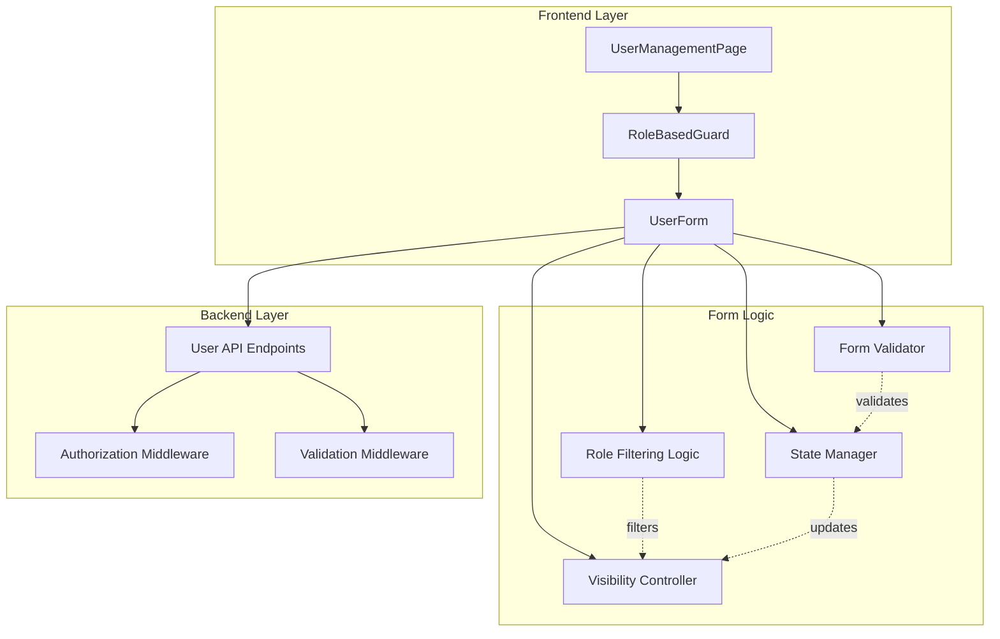

# Design Document

## Overview

The User Role Restrictions feature enhances the existing user management system by implementing proper role-based constraints and dynamic form behavior. This feature addresses three critical business requirements: enforcing a single admin per company, hiding irrelevant form fields based on role selection, and restricting user creation to admin users only.

### Key Design Principles

- **Single Admin Constraint**: Enforce one admin per company at both UI and validation layers
- **Dynamic Form Behavior**: Show/hide form fields based on selected role to prevent invalid configurations
- **Admin-Only User Creation**: Restrict user provisioning to admin users through access control
- **Progressive Enhancement**: Build on existing user management infrastructure without breaking changes
- **Client-Side Validation**: Provide immediate feedback to users before server-side validation

### Design Rationale

This feature is designed as an enhancement to the existing user management system rather than a complete rewrite. The design leverages existing components (UserForm, UserManagementPage) and adds conditional logic to enforce business rules. This approach minimizes code changes and maintains backward compatibility while adding critical constraints.

## Architecture

### Component Architecture



### Integration Points

This feature integrates with existing components:

1. **UserManagementPage**: Already has role-based access control via `canManageUsers()` permission check
2. **UserForm**: Existing form component that handles user creation and editing
3. **User API**: Existing endpoints for user CRUD operations
4. **Authentication Context**: Provides current user role for access control decisions


## Components and Interfaces

### Frontend Components

#### UserForm Enhancements

The UserForm component requires modifications to support dynamic role filtering and conditional field visibility:

```typescript
interface UserFormProps {
  user?: User | null  // Existing user for edit mode, null for create mode
  users: User[]       // All users in company (for admin existence check)
  onSubmit: (data: UserFormData) => Promise<void>
  onCancel: () => void
}

interface UserFormData {
  firstName: string
  lastName: string
  email: string
  password: string
  role: UserRole
  managerId?: string
  isManagerApprover: boolean
}

interface RoleOption {
  value: UserRole
  label: string
  disabled: boolean
  hidden: boolean
}
```

#### Helper Functions

**Role Filtering Logic**

```typescript
/**
 * Determines which roles should be available in the role dropdown
 * 
 * Design Decision: Admin role is NEVER displayed during user creation (per business rule
 * that only one admin exists per company and is created during company setup). When editing
 * an existing admin user, the admin role remains visible but disabled to show current state.
 */
const getAvailableRoles = (
  users: User[], 
  editingUser: User | null
): RoleOption[] => {
  const isEditingAdmin = editingUser?.role === UserRole.ADMIN
  
  return [
    {
      value: UserRole.ADMIN,
      label: 'Admin',
      disabled: isEditingAdmin,  // Disable when editing existing admin
      hidden: !isEditingAdmin  // Always hide during creation, only show when editing admin
    },
    {
      value: UserRole.MANAGER,
      label: 'Manager',
      disabled: false,
      hidden: false
    },
    {
      value: UserRole.EMPLOYEE,
      label: 'Employee',
      disabled: false,
      hidden: false
    }
  ]
}
```

**Visibility Controller**

```typescript
/**
 * Determines if manager approval checkbox should be visible
 * 
 * Design Decision: Only employees can have manager approval requirements
 * since managers and admins don't submit expenses
 */
const shouldShowManagerApprovalCheckbox = (role: UserRole): boolean => {
  return role === UserRole.EMPLOYEE
}
```

**State Manager**

```typescript
/**
 * Handles role changes and clears irrelevant fields
 * 
 * Design Decision: Automatically clear fields that become irrelevant when role changes
 * to prevent invalid data submission and reduce user confusion
 */
const handleRoleChange = (
  newRole: UserRole,
  currentFormData: UserFormData
): UserFormData => {
  const updatedData = { ...currentFormData, role: newRole }
  
  // Clear manager approval when switching to Manager or Admin
  if (newRole === UserRole.MANAGER || newRole === UserRole.ADMIN) {
    updatedData.isManagerApprover = false
  }
  
  // Clear managerId when switching to Admin (admins don't have managers)
  if (newRole === UserRole.ADMIN) {
    updatedData.managerId = undefined
  }
  
  return updatedData
}
```


#### Form Validator

```typescript
/**
 * Validates user form data with role-specific rules
 * 
 * Design Decision: Perform validation at form level before submission
 * to provide immediate feedback and reduce unnecessary API calls
 */
const validateForm = (
  formData: UserFormData,
  users: User[],
  isEditMode: boolean
): ValidationErrors => {
  const errors: ValidationErrors = {}
  
  // Validate admin uniqueness (only for new user creation)
  if (!isEditMode && formData.role === UserRole.ADMIN) {
    const hasAdmin = users.some(u => u.role === UserRole.ADMIN)
    if (hasAdmin) {
      errors.role = 'An admin already exists for this company'
    }
  }
  
  // Validate manager assignment when manager approval is required
  if (formData.role === UserRole.EMPLOYEE && 
      formData.isManagerApprover && 
      !formData.managerId) {
    errors.managerId = 'Manager must be assigned when manager approval is required'
  }
  
  // Standard field validations
  if (!formData.firstName?.trim()) {
    errors.firstName = 'First name is required'
  }
  
  if (!formData.lastName?.trim()) {
    errors.lastName = 'Last name is required'
  }
  
  if (!formData.email?.trim()) {
    errors.email = 'Email is required'
  }
  
  if (!isEditMode && !formData.password) {
    errors.password = 'Password is required'
  }
  
  return errors
}
```

### Backend API Enhancements

The backend already has proper authorization middleware in place. This feature primarily adds validation logic:

#### Validation Middleware

```typescript
/**
 * Validates user creation requests
 * 
 * Design Decision: Backend validation serves as the final authority
 * even if client-side validation is bypassed
 */
const validateUserCreation = async (
  req: Request,
  res: Response,
  next: NextFunction
) => {
  const { role, isManagerApprover, managerId } = req.body
  const creator = req.user
  
  // Verify creator is admin (redundant with requireAdmin middleware, but explicit)
  if (creator.role !== UserRole.ADMIN) {
    throw new AuthorizationError('Only administrators can create users')
  }
  
  // Prevent creating admin users
  if (role === UserRole.ADMIN) {
    throw new ValidationError('Cannot create additional admin users')
  }
  
  // Validate manager approval settings
  if (role === UserRole.EMPLOYEE && isManagerApprover && !managerId) {
    throw new ValidationError('Manager must be assigned when manager approval is required')
  }
  
  // Ensure manager approval is false for non-employees
  if ((role === UserRole.MANAGER || role === UserRole.ADMIN) && isManagerApprover) {
    throw new ValidationError('Manager approval setting only applies to employees')
  }
  
  next()
}
```


## Data Models

### No Database Schema Changes

This feature does not require any database schema modifications. It works with the existing User model:

```typescript
interface User {
  id: string
  companyId: string
  email: string
  firstName: string
  lastName: string
  role: UserRole  // Existing field with ADMIN, MANAGER, EMPLOYEE values
  managerId?: string  // Existing field
  isManagerApprover: boolean  // Existing field
  createdAt: Date
  updatedAt: Date
}

enum UserRole {
  ADMIN = 'ADMIN',
  MANAGER = 'MANAGER',
  EMPLOYEE = 'EMPLOYEE'
}
```

### Form State Model

```typescript
interface UserFormState {
  // Form field values
  firstName: string
  lastName: string
  email: string
  password: string
  role: UserRole
  managerId?: string
  isManagerApprover: boolean
  
  // UI state
  errors: ValidationErrors
  isSubmitting: boolean
  
  // Computed state
  availableRoles: RoleOption[]
  showManagerApprovalCheckbox: boolean
}

interface ValidationErrors {
  firstName?: string
  lastName?: string
  email?: string
  password?: string
  role?: string
  managerId?: string
  isManagerApprover?: string
}
```

## Error Handling

### Client-Side Error Handling

**Validation Errors**

Display inline validation errors next to form fields:

```typescript
// Error display component
<div className="form-field">
  <label htmlFor="role">Role</label>
  <select 
    id="role" 
    value={formData.role}
    onChange={handleRoleChange}
    className={errors.role ? 'error' : ''}
  >
    {/* options */}
  </select>
  {errors.role && (
    <span className="error-message">{errors.role}</span>
  )}
</div>
```

**Access Control Errors**

Handle unauthorized access gracefully:

```typescript
// In UserManagementPage
if (!canManageUsers(currentUser)) {
  return (
    <div className="access-denied">
      <h2>Access Denied</h2>
      <p>You do not have permission to manage users.</p>
      <p>Only administrators can create and manage users.</p>
    </div>
  )
}
```

### Server-Side Error Handling

**Authorization Errors (403)**

```typescript
// Middleware catches and returns
{
  status: 'error',
  message: 'Only administrators can create users',
  code: 'INSUFFICIENT_PERMISSIONS'
}
```

**Validation Errors (400)**

```typescript
// Validation middleware returns
{
  status: 'error',
  message: 'Validation failed',
  errors: {
    role: 'Cannot create additional admin users',
    managerId: 'Manager must be assigned when manager approval is required'
  }
}
```


## UI/UX Design Patterns

### Dynamic Form Behavior

The form implements progressive disclosure - showing only relevant fields based on the selected role:

#### Role Dropdown States

**Creating New User (No Admin Exists)**
```
Role: [Select Role ▼]
  - Admin
  - Manager
  - Employee
```

**Creating New User (Admin Exists)**
```
Role: [Select Role ▼]
  - Manager
  - Employee
```

**Editing Existing Admin**
```
Role: [Admin ▼] (disabled)
  - Admin (selected, disabled)
```

**Editing Existing Manager/Employee**
```
Role: [Manager ▼]
  - Manager
  - Employee
```

#### Manager Approval Checkbox Visibility

**When Role = Employee**
```
☐ Manager must approve expenses first
  This employee's expenses will require manager approval before 
  being processed through the approval workflow.
```

**When Role = Manager or Admin**
```
(Checkbox completely hidden - not just disabled)
```

### Visual Feedback

**Validation Error Display**

```
Role: [Admin ▼]
⚠️ An admin already exists for this company
```

**Disabled State Styling**

```css
select:disabled {
  background-color: #f3f4f6;
  cursor: not-allowed;
  opacity: 0.6;
}
```

**Hidden Field Behavior**

Use CSS display: none or conditional rendering to completely remove hidden fields from the DOM, not just hide them visually. This ensures:
- Screen readers don't announce hidden fields
- Tab navigation skips hidden fields
- Form submission doesn't include hidden field values

### Accessibility Considerations

**ARIA Labels for Dynamic Content**

```typescript
<select
  id="role"
  aria-label="User role"
  aria-describedby={errors.role ? 'role-error' : undefined}
  aria-invalid={!!errors.role}
>
  {/* options */}
</select>

{errors.role && (
  <span id="role-error" role="alert" className="error-message">
    {errors.role}
  </span>
)}
```

**Screen Reader Announcements**

When role changes and fields appear/disappear, use aria-live regions:

```typescript
<div aria-live="polite" aria-atomic="true" className="sr-only">
  {showManagerApprovalCheckbox 
    ? 'Manager approval option is now available'
    : 'Manager approval option is not applicable for this role'
  }
</div>
```


## Implementation Strategy

### Phase 1: Role Filtering Logic

Implement the core logic for determining which roles should be available:

1. Create `getAvailableRoles()` helper function
2. Add logic to check for existing admin in users array
3. Handle edit mode vs create mode scenarios
4. Return filtered role options with visibility and disabled states

**Design Decision**: Implement as a pure function that takes users array and editing user as parameters. This makes it easy to test and reuse.

### Phase 2: Form UI Updates

Update the UserForm component to use filtered roles:

1. Integrate `getAvailableRoles()` into form state
2. Update role dropdown rendering to respect hidden/disabled states
3. Add conditional rendering for manager approval checkbox
4. Implement `shouldShowManagerApprovalCheckbox()` helper

**Design Decision**: Use conditional rendering (not CSS visibility) to completely remove hidden elements from the DOM for better accessibility.

### Phase 3: State Management

Enhance form state management to handle role transitions:

1. Update `handleInputChange` to detect role changes
2. Clear irrelevant fields when role changes (managerId, isManagerApprover)
3. Clear validation errors for hidden fields
4. Maintain other form field values during transitions

**Design Decision**: Automatically clear fields rather than showing validation errors for hidden fields. This provides a better user experience and prevents confusion.

### Phase 4: Validation

Add validation rules for role-specific constraints:

1. Implement admin uniqueness validation in `validateForm()`
2. Add manager requirement validation when manager approval is enabled
3. Display validation errors inline with form fields
4. Ensure validation only applies to relevant scenarios (create vs edit)

**Design Decision**: Validate at form level before submission to provide immediate feedback. Backend validation serves as the final authority.

### Phase 5: Access Control Verification

Verify existing access control mechanisms are working:

1. Confirm `canManageUsers()` permission check in UserManagementPage
2. Verify Create User button visibility is role-based
3. Ensure non-admin users see access denied message
4. Test backend authorization middleware

**Design Decision**: Leverage existing access control infrastructure rather than reimplementing. This feature enhances rather than replaces existing security.

### Phase 6: Testing and Verification

Comprehensive testing of all scenarios:

1. Test role dropdown behavior in all scenarios
2. Test manager approval checkbox visibility
3. Test form state transitions
4. Test validation error display
5. Test access control for admin and non-admin users


## Testing Strategy

### Unit Testing

**Role Filtering Logic Tests**

```typescript
describe('getAvailableRoles', () => {
  it('should hide admin option when creating new user and admin exists', () => {
    const users = [{ id: '1', role: UserRole.ADMIN, /* ... */ }]
    const roles = getAvailableRoles(users, null)
    
    const adminRole = roles.find(r => r.value === UserRole.ADMIN)
    expect(adminRole.hidden).toBe(true)
  })
  
  it('should show admin option when editing existing admin', () => {
    const users = [{ id: '1', role: UserRole.ADMIN, /* ... */ }]
    const editingUser = users[0]
    const roles = getAvailableRoles(users, editingUser)
    
    const adminRole = roles.find(r => r.value === UserRole.ADMIN)
    expect(adminRole.hidden).toBe(false)
    expect(adminRole.disabled).toBe(true)
  })
  
  it('should show all roles when no admin exists', () => {
    const users = [{ id: '1', role: UserRole.MANAGER, /* ... */ }]
    const roles = getAvailableRoles(users, null)
    
    expect(roles.every(r => !r.hidden)).toBe(true)
  })
})
```

**Visibility Controller Tests**

```typescript
describe('shouldShowManagerApprovalCheckbox', () => {
  it('should return true for Employee role', () => {
    expect(shouldShowManagerApprovalCheckbox(UserRole.EMPLOYEE)).toBe(true)
  })
  
  it('should return false for Manager role', () => {
    expect(shouldShowManagerApprovalCheckbox(UserRole.MANAGER)).toBe(false)
  })
  
  it('should return false for Admin role', () => {
    expect(shouldShowManagerApprovalCheckbox(UserRole.ADMIN)).toBe(false)
  })
})
```

**State Management Tests**

```typescript
describe('handleRoleChange', () => {
  it('should clear isManagerApprover when switching to Manager', () => {
    const formData = {
      role: UserRole.EMPLOYEE,
      isManagerApprover: true,
      /* ... */
    }
    
    const result = handleRoleChange(UserRole.MANAGER, formData)
    expect(result.isManagerApprover).toBe(false)
  })
  
  it('should clear managerId when switching to Admin', () => {
    const formData = {
      role: UserRole.EMPLOYEE,
      managerId: 'manager-123',
      /* ... */
    }
    
    const result = handleRoleChange(UserRole.ADMIN, formData)
    expect(result.managerId).toBeUndefined()
  })
  
  it('should maintain other form fields during role change', () => {
    const formData = {
      firstName: 'John',
      lastName: 'Doe',
      email: 'john@example.com',
      role: UserRole.EMPLOYEE,
      /* ... */
    }
    
    const result = handleRoleChange(UserRole.MANAGER, formData)
    expect(result.firstName).toBe('John')
    expect(result.lastName).toBe('Doe')
    expect(result.email).toBe('john@example.com')
  })
})
```

**Validation Tests**

```typescript
describe('validateForm', () => {
  it('should return error when creating admin and admin exists', () => {
    const users = [{ id: '1', role: UserRole.ADMIN, /* ... */ }]
    const formData = { role: UserRole.ADMIN, /* ... */ }
    
    const errors = validateForm(formData, users, false)
    expect(errors.role).toBe('An admin already exists for this company')
  })
  
  it('should not return error when editing existing admin', () => {
    const users = [{ id: '1', role: UserRole.ADMIN, /* ... */ }]
    const formData = { role: UserRole.ADMIN, /* ... */ }
    
    const errors = validateForm(formData, users, true)
    expect(errors.role).toBeUndefined()
  })
  
  it('should return error when manager approval enabled without manager', () => {
    const formData = {
      role: UserRole.EMPLOYEE,
      isManagerApprover: true,
      managerId: undefined,
      /* ... */
    }
    
    const errors = validateForm(formData, [], false)
    expect(errors.managerId).toBe('Manager must be assigned when manager approval is required')
  })
})
```


### Integration Testing

**Component Integration Tests**

```typescript
describe('UserForm Integration', () => {
  it('should hide manager approval checkbox when Manager role selected', () => {
    const { getByLabelText, queryByLabelText } = render(
      <UserForm users={[]} onSubmit={jest.fn()} onCancel={jest.fn()} />
    )
    
    const roleSelect = getByLabelText('Role')
    fireEvent.change(roleSelect, { target: { value: UserRole.MANAGER } })
    
    expect(queryByLabelText(/Manager must approve/i)).not.toBeInTheDocument()
  })
  
  it('should show manager approval checkbox when Employee role selected', () => {
    const { getByLabelText } = render(
      <UserForm users={[]} onSubmit={jest.fn()} onCancel={jest.fn()} />
    )
    
    const roleSelect = getByLabelText('Role')
    fireEvent.change(roleSelect, { target: { value: UserRole.EMPLOYEE } })
    
    expect(getByLabelText(/Manager must approve/i)).toBeInTheDocument()
  })
  
  it('should display validation error when creating admin and admin exists', async () => {
    const users = [{ id: '1', role: UserRole.ADMIN, /* ... */ }]
    const { getByLabelText, getByText, findByText } = render(
      <UserForm users={users} onSubmit={jest.fn()} onCancel={jest.fn()} />
    )
    
    // Try to select Admin role (should not be available)
    const roleSelect = getByLabelText('Role')
    const adminOption = roleSelect.querySelector('option[value="ADMIN"]')
    
    expect(adminOption).toBeNull() // Admin option should not exist
  })
})
```

**Access Control Integration Tests**

```typescript
describe('UserManagementPage Access Control', () => {
  it('should show Create User button for admin users', () => {
    const adminUser = { role: UserRole.ADMIN, /* ... */ }
    const { getByText } = render(
      <AuthProvider value={{ user: adminUser }}>
        <UserManagementPage />
      </AuthProvider>
    )
    
    expect(getByText('Create User')).toBeInTheDocument()
  })
  
  it('should hide Create User button for non-admin users', () => {
    const managerUser = { role: UserRole.MANAGER, /* ... */ }
    const { queryByText } = render(
      <AuthProvider value={{ user: managerUser }}>
        <UserManagementPage />
      </AuthProvider>
    )
    
    expect(queryByText('Create User')).not.toBeInTheDocument()
  })
  
  it('should show access denied message for non-admin users', () => {
    const employeeUser = { role: UserRole.EMPLOYEE, /* ... */ }
    const { getByText } = render(
      <AuthProvider value={{ user: employeeUser }}>
        <UserManagementPage />
      </AuthProvider>
    )
    
    expect(getByText(/Access Denied/i)).toBeInTheDocument()
    expect(getByText(/Only administrators can create and manage users/i)).toBeInTheDocument()
  })
})
```

### Manual Testing Checklist

**Role Dropdown Behavior**
- [ ] Admin option hidden when creating new user with existing admin
- [ ] Admin option visible but disabled when editing existing admin
- [ ] All roles visible when creating new user without existing admin
- [ ] Manager and Employee options always available for selection

**Manager Approval Checkbox**
- [ ] Checkbox visible when Employee role selected
- [ ] Checkbox hidden when Manager role selected
- [ ] Checkbox hidden when Admin role selected
- [ ] Checkbox state cleared when switching from Employee to Manager/Admin
- [ ] Checkbox state preserved when switching between Employee and back

**Form State Management**
- [ ] managerId cleared when role changes to Admin
- [ ] isManagerApprover cleared when role changes to Manager or Admin
- [ ] Other form fields (firstName, lastName, email) preserved during role changes
- [ ] Validation errors cleared for fields that become hidden

**Validation**
- [ ] Error displayed when attempting to create admin with existing admin
- [ ] Error displayed when manager approval enabled without manager assigned
- [ ] No error when editing existing admin user
- [ ] Validation errors clear when issues resolved

**Access Control**
- [ ] Admin users see Create User button
- [ ] Non-admin users don't see Create User button
- [ ] Non-admin users see access denied message on user management page
- [ ] Backend returns 403 when non-admin attempts user creation

**User Creation Flow**
- [ ] Successfully create Employee with manager approval
- [ ] Successfully create Employee without manager approval
- [ ] Successfully create Manager
- [ ] Cannot create Admin when admin exists
- [ ] Form submission includes correct field values

**User Editing Flow**
- [ ] Successfully edit existing Employee
- [ ] Successfully edit existing Manager
- [ ] Can view but not change Admin role when editing admin
- [ ] Form pre-populates with existing user data
- [ ] Changes save correctly


## Security Considerations

### Frontend Security

**Role-Based UI Rendering**

The frontend implements defense-in-depth by hiding UI elements from unauthorized users:

```typescript
// Only show Create User button to admins
{currentUser.role === UserRole.ADMIN && (
  <button onClick={openCreateUserForm}>Create User</button>
)}
```

**Design Decision**: Frontend security is for UX purposes only. All security enforcement happens on the backend. The frontend prevents accidental unauthorized actions but doesn't prevent intentional bypass attempts.

### Backend Security

**Authorization Middleware**

```typescript
// Protect user creation endpoint
router.post('/api/users', 
  requireAuth,           // Verify user is authenticated
  requireAdmin,          // Verify user is admin
  validateUserCreation,  // Validate request data
  createUser             // Handle request
)
```

**Single Admin Constraint Enforcement**

The backend enforces the single admin constraint at multiple levels:

1. **Validation Layer**: Rejects requests to create admin users
2. **Service Layer**: Checks admin count before user creation
3. **Database Layer**: Could add unique constraint on (companyId, role) where role = 'ADMIN' for additional safety

**Design Decision**: Prevent admin creation entirely rather than allowing it with validation. This is simpler and more secure than trying to manage admin transitions.

### Data Integrity

**Form State Consistency**

Automatically clearing irrelevant fields prevents invalid data combinations:

- Manager with isManagerApprover = true (invalid)
- Admin with managerId set (invalid)
- Employee with isManagerApprover = true but no managerId (invalid)

**Design Decision**: Clear fields automatically rather than relying on validation to catch invalid combinations. This is more user-friendly and reduces the chance of data integrity issues.

## Performance Considerations

### Minimal Performance Impact

This feature has negligible performance impact because:

1. **No Additional API Calls**: Uses existing user data already loaded for the user management page
2. **Simple Computations**: Role filtering and visibility checks are O(n) operations on small datasets (company users)
3. **No Database Changes**: No new queries or indexes required
4. **Client-Side Logic**: Most logic runs in the browser without server round-trips

### Optimization Opportunities

If performance becomes a concern with large user lists:

```typescript
// Memoize role filtering to avoid recalculation on every render
const availableRoles = useMemo(
  () => getAvailableRoles(users, editingUser),
  [users, editingUser]
)

// Memoize visibility check
const showManagerApproval = useMemo(
  () => shouldShowManagerApprovalCheckbox(formData.role),
  [formData.role]
)
```

**Design Decision**: Start without memoization. Add it only if profiling shows it's needed. Premature optimization adds complexity without proven benefit.


## Edge Cases and Error Scenarios

### Edge Case: Deleting the Only Admin

**Scenario**: What happens if someone tries to delete the only admin user?

**Solution**: This is outside the scope of this feature but should be handled by the user deletion logic. The system should either:
1. Prevent deletion of the only admin
2. Require assigning a new admin before deletion
3. Require company deletion if removing the only admin

**Design Decision**: This feature focuses on creation restrictions. Deletion restrictions should be handled separately in the user deletion feature.

### Edge Case: Concurrent Admin Creation

**Scenario**: Two admins try to create a new admin user simultaneously before either transaction completes.

**Solution**: Backend validation checks admin existence within a transaction. Database-level constraints could provide additional safety:

```sql
-- Optional: Add unique partial index for additional safety
CREATE UNIQUE INDEX idx_unique_admin_per_company 
ON users (company_id) 
WHERE role = 'ADMIN';
```

**Design Decision**: Rely on application-level validation for now. Add database constraint if concurrent creation becomes a real issue.

### Edge Case: Editing User While Admin Status Changes

**Scenario**: User A starts editing a user while User B promotes/demotes the admin.

**Solution**: Form uses stale data until refresh. This is acceptable because:
1. Admin changes are rare
2. Backend validation will catch any issues
3. User can refresh to see current state

**Design Decision**: Don't implement real-time updates for this rare scenario. Keep the implementation simple.

### Edge Case: Manager Approval Checkbox Checked Then Role Changed

**Scenario**: User checks manager approval checkbox, then changes role to Manager.

**Solution**: The `handleRoleChange` function automatically clears `isManagerApprover` when role changes to Manager or Admin.

**Design Decision**: Automatically clear the field rather than showing a validation error. This provides better UX and prevents user confusion.

### Edge Case: Form Validation Errors on Hidden Fields

**Scenario**: User has validation errors on manager approval, then changes role to Manager (hiding the field).

**Solution**: Clear validation errors for fields that become hidden:

```typescript
const handleRoleChange = (newRole: UserRole) => {
  setFormData(prev => ({
    ...prev,
    role: newRole,
    isManagerApprover: newRole === UserRole.EMPLOYEE ? prev.isManagerApprover : false
  }))
  
  // Clear errors for fields that are now hidden
  setErrors(prev => {
    const newErrors = { ...prev }
    if (newRole !== UserRole.EMPLOYEE) {
      delete newErrors.isManagerApprover
      delete newErrors.managerId
    }
    return newErrors
  })
}
```

**Design Decision**: Clear errors for hidden fields to avoid confusing the user with errors they can't see or fix.


## Future Enhancements

### Potential Future Features

While not in scope for this feature, these enhancements could be considered later:

**1. Admin Transfer Functionality**

Allow transferring admin role from one user to another:
- Current admin selects a user to promote
- System demotes current admin to manager/employee
- System promotes selected user to admin
- Maintains single admin constraint throughout transition

**2. Temporary Admin Delegation**

Allow admin to temporarily delegate admin privileges:
- Set time-limited admin access for another user
- Automatically revoke after specified duration
- Maintain audit trail of delegations

**3. Admin Role Restrictions**

Add granular permissions within admin role:
- User management admin
- Approval rules admin
- Company settings admin
- Allows multiple "admins" with different capabilities

**4. Role Change Workflow**

Implement approval workflow for role changes:
- Require admin approval for role promotions
- Notify affected users of role changes
- Maintain history of role changes

**5. Bulk User Import**

Allow admins to import multiple users:
- CSV upload with role assignments
- Validation of single admin constraint
- Preview before import
- Error handling for invalid data

### Design Extensibility

The current design supports these future enhancements:

- **Helper Functions**: Pure functions can be easily extended with additional logic
- **Validation Layer**: Centralized validation makes it easy to add new rules
- **Component Structure**: Modular components can be enhanced without major refactoring
- **Backend Middleware**: Middleware pattern allows adding new validation steps

**Design Decision**: Keep the current implementation simple and focused. Add complexity only when business requirements demand it.

## Conclusion

This design document outlines a focused enhancement to the user management system that enforces critical business rules through a combination of UI constraints, client-side validation, and backend authorization. The design prioritizes:

1. **User Experience**: Dynamic form behavior provides immediate feedback and prevents invalid configurations
2. **Security**: Multi-layered validation ensures business rules are enforced even if UI is bypassed
3. **Maintainability**: Pure functions and modular components make the code easy to test and extend
4. **Simplicity**: Minimal changes to existing codebase reduce risk and complexity

The implementation follows established patterns in the codebase and integrates seamlessly with existing user management functionality.
